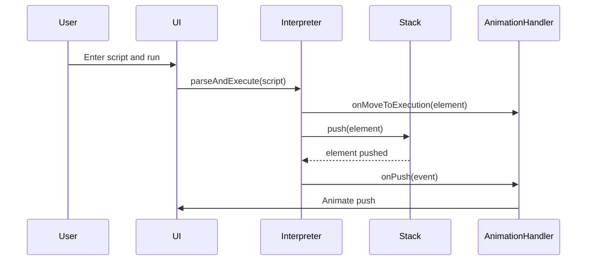

# Script Execution and Animation Simulator

This project simulates the execution of scripts, similar to those found in
Bitcoin's Script language. The simulator provides a visual representation
of how scripts are parsed, processed, and how each element interacts with
a stack during execution. The animations help in
understanding the step-by-step operations and stack manipulations.

## Project Overview

The Script Execution and Animation Simulator is designed to:

- Parse script input entered by the user.
- Visually animate the movement of script elements from an input field
to a script execution section.
- Execute each script element step-by-step, animating stack operations
like push, pop, and others.
- Provide a clear and educational way to understand stack-based script execution.

## Features

- **Script Parsing:** Parses the user input script and identifies opcodes
and data elements.
- **Stack Operations:** Supports standard stack operations such as `push`,
`pop`, and `peek`.
- **Visual Animation:** Animates the movement of elements between different
sections of the UI (input, operation-result, stack).
- **Event-Driven Architecture:** Uses event binding to trigger animations and operations.

## Setup Instructions

### Prerequisites

- [Node.js](https://nodejs.org/) installed on your machine.

### Installation

1. **Clone the repository:**

   ```bash
   git clone https://github.com/your-username/script-execution-simulator.git
   cd script-execution-simulator

2. Run the application:
To run the application, execute

```shell
npm start
```

Then, `open http://localhost:3000` in your web browser to view and use the simulator.

### Usage

Enter Script:

1. Input a script in the designated text field, where the script should be formatted with opcodes and data elements separated by spaces (e.g., OP_DUP OP_HASH160 02a8... OP_EQUALVERIFY OP_CHECKSIG).
Run Script:

2. Click on the "Run Script" button to start the process. The elements will move into the script execution area and get processed one by one with corresponding stack operations animated on the UI.

### Event Flow Diagram

A visual representation of the event-driven architecture used in the simulator. This diagram illustrates how different events trigger various operations and animations within the system. To view this diagram, you can use tools like Mermaid or PlantUML.



### Technologies Used

- JavaScript (ES6+)
- HTML5
- CSS3
- Node.js to manage mjs modules
- Event-driven architecture for managing the stack operations and animations

### Contributing

If you'd like to contribute to this project:

1. Fork the repository.
2. Create a new branch (git checkout -b feature/YourFeature).
3. Make your changes.
4. Commit your changes (git commit -m 'Add your feature').
5. Push to the branch (git push origin feature/YourFeature).
6. Open a pull request.
7. License:

### License

This project is licensed under the MIT License.
